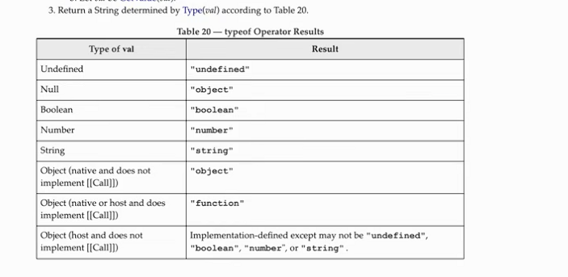
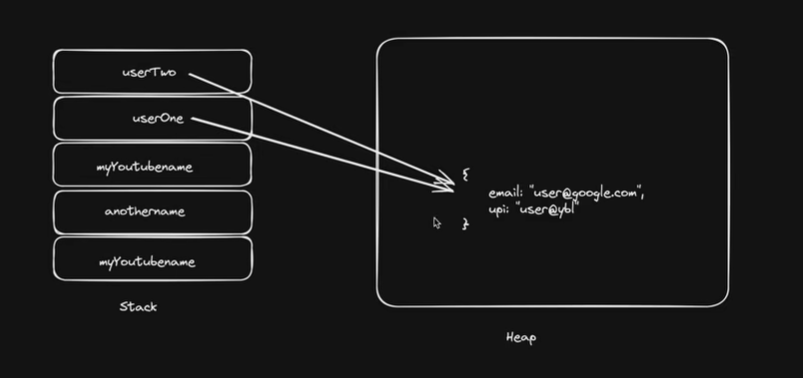

# JavaScript-Learning-HiteshChoudhary-Youtube
A)Data types:
typeof :-

b)Memory & Threads

****Tools***
json formatter-->format the json data to investigate.
RandomAPI--> for json 

******Inteviews*******
c)Priority --->
  1.OOPS
  2.Arrays
  3.Functions

***Executive and Call Stack***
Screenshot 2026-08-19 000515.png

***Call Stack***
Call stack is the Stack is the way to implement multiple fn in the order of stack following LIFO.
For ex ->
if their are three seperate function then call stack flow will be applied as:
Memory phase->Execution phase->Global scope & then fn 1 will be executed and output achieved.
In call stack it will apply it one by one.
But if nested loop is present then all functions will enter into the call stack first in the sequence of defination & then LIFO will be followed also with Execution state.
